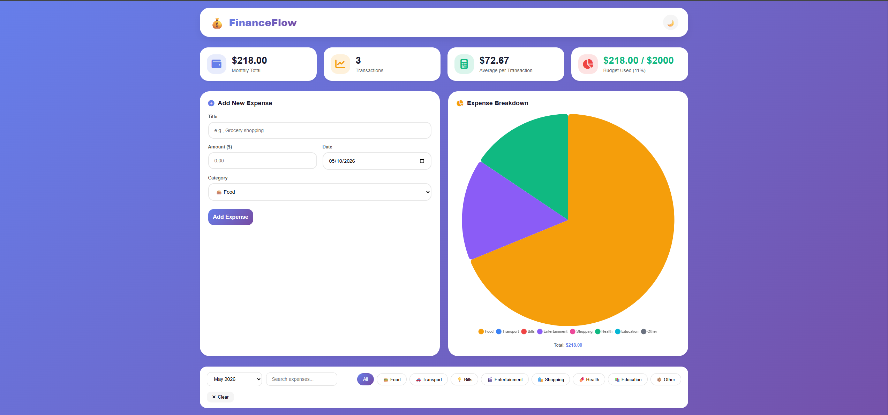
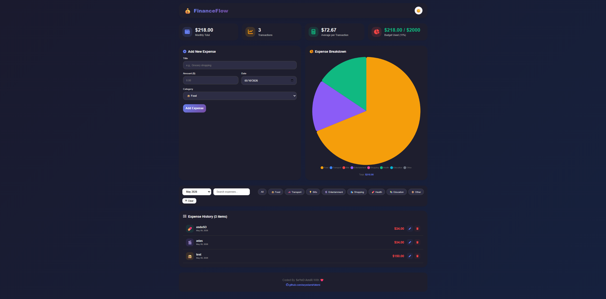

# FinanceFlow 💰 - Personal Expense Tracker

[](https://your-demo-link.vercel.app)
[](https://github.com/seyedamirfatemi/expense-tracker)
[](LICENSE)
[]()

> **Take Control of Your Finances** — Track, analyze, and optimize your spending with a beautiful dashboard


## 📸 Screenshots

| Dashboard Overview | Add Expense Form |
|-------------------|------------------|
|  |  |

---

## 📖 Table of Contents

- [English Version](#english-version)
  - [Features](#features)
  - [Technologies Used](#technologies-used)
  - [Installation](#installation)
  - [Usage Guide](#usage-guide)
  - [Expense Categories](#expense-categories)
  - [Folder Structure](#folder-structure)
  - [Keyboard Shortcuts](#keyboard-shortcuts)
  - [Future Improvements](#future-improvements)
  - [Browser Support](#browser-support)
- [نسخه فارسی](#نسخه-فارسی)
  - [ویژگی‌ها](#ویژگی‌ها)
  - [تکنولوژی‌های استفاده شده](#تکنولوژی‌های-استفاده-شده)
  - [نصب و اجرا](#نصب-و-اجرا)
  - [راهنمای استفاده](#راهنمای-استفاده)
  - [دسته‌بندی‌های هزینه](#دسته‌بندی‌های-هزینه)
  - [ساختار پوشه‌ها](#ساختار-پوشه‌ها)
  - [میانبرهای صفحه کلید](#میانبرهای-صفحه-کلید)
  - [بهبودهای آتی](#بهبودهای-آتی)
  - [مرورگرهای پشتیبانی شده](#مرورگرهای-پشتیبانی-شده)
- [Credits](#credits)

---

# English Version

## 🚀 Features

| Feature | Description |
|---------|-------------|
| 💵 **Add Expenses** | Quick form to add expenses with title, amount, category, and date |
| ✏️ **Edit Expenses** | Modify existing expenses with pre-filled form |
| 🗑️ **Delete Expenses** | Remove unwanted entries with confirmation |
| 📊 **Pie Chart** | Visual breakdown of spending by category |
| 📈 **Statistics Cards** | Monthly total, transaction count, average expense, budget usage |
| 🔍 **Search** | Filter expenses by title or description |
| 🗓️ **Month Filter** | View expenses from any of the last 12 months |
| 🏷️ **Category Filter** | Filter by 8 different expense categories |
| 🎯 **Budget Tracking** | $2000 monthly budget with visual progress bar |
| ⚠️ **Budget Alerts** | Color-coded warning when exceeding budget |
| 🌓 **Dark/Light Mode** | Theme preference saved in localStorage |
| 💾 **Local Storage** | All data persists between sessions |
| 📱 **Fully Responsive** | Works perfectly on mobile, tablet, and desktop |
| 🎨 **Modern UI** | Glassmorphism design with smooth animations |

## 🛠️ Technologies Used

| Technology | Purpose |
|------------|---------|
| **React 18** | Frontend framework |
| **Vite** | Build tool and dev server |
| **Chart.js + react-chartjs-2** | Pie chart visualization |
| **date-fns** | Date manipulation and formatting |
| **CSS3** | Styling, animations, responsive design |
| **FontAwesome 6** | Icons |
| **Google Fonts (Inter)** | Typography |
| **LocalStorage** | Data persistence |

## 📦 Installation

### Prerequisites
- Node.js (v16 or higher)
- npm or yarn

### Step-by-Step Installation

```bash
# Clone the repository
git clone https://github.com/seyedamirfatemi/expense-tracker.git
cd expense-tracker

# Install dependencies
npm install

# Start development server
npm run dev

# Build for production
npm run build

# Preview production build
npm run preview
